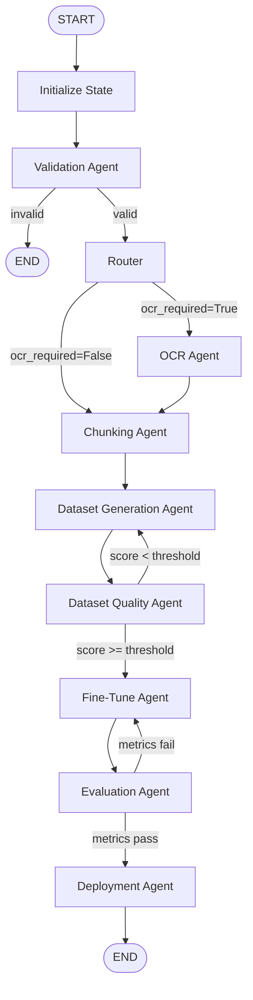

# ModifAI — LangGraph Orchestration Layer

> **Production-grade multi-agent pipeline backbone built with LangGraph, LangChain, and Pydantic.**

---

## Architecture

Every agent is an independent Python function that:

1. **Reads** from the shared `ModifAIState`
2. **Performs** one responsibility
3. **Returns** only the fields it updates

LangGraph merges partial returns back into the full state and controls all transitions via edges and conditional routing functions. Agents **never** call each other directly.

---

## Workflow



---

## Folder Structure

```
modifai/
├── app.py                     ← Entry point (3 demo scenarios)
├── requirements.txt
│
├── config/
│   └── settings.py            ← Immutable thresholds & constants
│
├── graph/
│   ├── state.py               ← ModifAIState TypedDict (shared state)
│   ├── graph_builder.py       ← build_graph() — single topology source
│   └── routers.py             ← Pure conditional routing functions
│
├── agents/
│   ├── validation.py          ← Validates prompt, detects OCR need
│   ├── ocr.py                 ← Extracts text from documents
│   ├── chunking.py            ← Splits text into chunks
│   ├── generation.py          ← Generates training dataset
│   ├── quality.py             ← Scores dataset quality
│   ├── finetune.py            ← Submits fine-tuning job
│   ├── evaluation.py          ← Evaluates trained model
│   └── deployment.py          ← Deploys model to endpoint
│
├── schemas/
│   └── state_schema.py        ← Pydantic input validator + to_initial_state()
│
└── utils/
    ├── logger.py              ← get_logger() factory
    └── node_helpers.py        ← enter_node / leave_node / build_base_update
```

---

## Conditional Routing

| Decision Point | Condition | Next Node |
|---|---|---|
| After Validation | `validation_status == False` | `END` |
| After Validation | `validation_status == True` | `router` |
| Router | `ocr_required == True` | `ocr_agent` |
| Router | `ocr_required == False` | `chunking_agent` |
| After Quality | `score >= QUALITY_THRESHOLD` | `finetune_agent` |
| After Quality | `score < QUALITY_THRESHOLD` | `generation_agent` (loop) |
| After Evaluation | metrics acceptable | `deployment_agent` |
| After Evaluation | metrics unacceptable | `finetune_agent` (loop) |

---

## Shared State Design

`ModifAIState` is a `TypedDict` (required by LangGraph's `StateGraph`).

Input validation uses a separate Pydantic `ModifAIInputSchema` in `schemas/state_schema.py`. The `to_initial_state()` method converts the validated model into a plain dict for graph invocation.

List fields with **append** reducers:

```python
execution_history: Annotated[List[str], operator.add]
errors:            Annotated[List[str], operator.add]
```

All other fields use the default **replace** reducer (last write wins).

---

## Quick Start

```bash
# 1. Install dependencies
pip install -r requirements.txt

# 2. Run the demo (3 scenarios)
python app.py

# 3. Run the test suite
pytest tests/ -v
```

---

## Adding a New Agent

1. Add a new field to `ModifAIState` in `graph/state.py`.
2. Create `agents/my_agent.py` following the existing pattern.
3. Register the node in `graph/graph_builder.py`:
   ```python
   builder.add_node("my_agent", my_agent)
   builder.add_edge("upstream_node", "my_agent")
   ```
4. Add a routing function in `graph/routers.py` if conditional logic is needed.

No other file needs to change.

---

## Configuration

Edit `config/settings.py` to adjust thresholds:

| Setting | Default | Description |
|---|---|---|
| `QUALITY_THRESHOLD` | `0.85` | Min dataset quality score to proceed to fine-tuning |
| `EVAL_PASS_THRESHOLD` | `0.80` | Min model accuracy to proceed to deployment |
| `MAX_RETRY_LOOPS` | `3` | Safety cap on retry loops (informational) |
| `LOG_LEVEL` | `"INFO"` | Python logging level |

---

## Milestone Status

- [x] LangGraph orchestration backbone
- [x] Shared `ModifAIState` TypedDict with list-append reducers
- [x] All 8 stub agents (Validation, OCR, Chunking, Generation, Quality, Fine-Tune, Evaluation, Deployment)
- [x] 4 conditional routing points (LangGraph `add_conditional_edges`)
- [x] Pydantic entry-point validation
- [x] Centralised logger + `node_helpers` (no copy-paste boilerplate)
- [x] Smoke test suite (happy path, OCR path, validation failure)
- [ ] Real OCR implementation (AWS Textract)
- [ ] Real dataset generation (Amazon Bedrock / LLM)
- [ ] Real fine-tuning (Amazon SageMaker)
- [ ] Real evaluation (batch inference + metrics)
- [ ] Real deployment (SageMaker endpoint / API Gateway)
