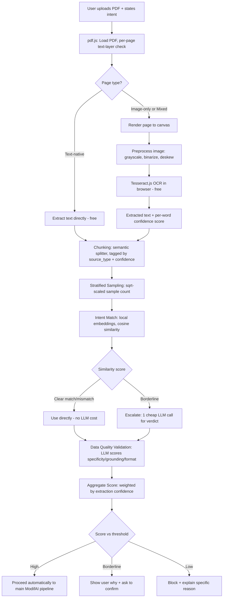

# ModifAI — Input Validation Module Build Manual
### (Intent Classification Agent + Data Quality Validation)

**Purpose of this document:** This is a complete, self-contained build guide for one piece of the ModifAI hackathon project: the very first step in the pipeline, where we check whether the document a user uploaded actually matches what they said they want, and whether the document is good enough quality to build anything useful from. If it's handed to a fresh Claude conversation, that conversation should be able to build this module from scratch using only what's written here.

**Read this first if you're a teammate:** Section 1 explains *why* this exists in plain English. Section 2 explains the big architectural decision we made. Everything after that is implementation detail — you don't need to read it top to bottom, you can jump to the module you're working on.

---

## 1. What are we building, and why? (Plain English)

When a user uploads a PDF and says "build me an HR policy assistant," two things can go wrong before we even start doing real work:

1. **Wrong document.** The PDF is actually a sales contract, not an HR policy. If we proceed anyway, we waste compute/credits generating garbage and the user is disappointed.
2. **Bad document.** The PDF is a blurry scan, mostly empty, or in a language we can't process well. Even if it's the right *kind* of document, the output quality will be bad.

So before ModifAI spends any real compute on dataset generation, agent discovery, or fine-tuning, it runs a **cheap, fast gate**: sample a few pages, check if they match the user's stated intent, check if the content is usable, and only let the expensive pipeline continue if both checks pass. If they don't pass, we tell the user exactly why — not just "error."

This is the **Intent Classification Agent** (does the doc match what the user said?) and the **Data Quality Validation** step (is the doc usable at all?), running as one combined gate before the rest of the ModifAI pipeline (which uses LangChain/LangGraph) kicks in.

**The guiding rule for this whole module: spend money only when a cheap check can't decide.** Free, local checks run first, on everything. Paid LLM calls only run on the small number of cases that are genuinely ambiguous.

---

## 2. The Big Architectural Decision: OCR runs in the user's browser, for free

Most OCR services (AWS Textract, Google Document AI, Azure) charge per page and require uploading the document to their cloud. We are avoiding that entirely.

**Decision:** We use **Tesseract.js**, a pure JavaScript OCR engine, and we run it **client-side, in the user's own browser tab**, using WebAssembly. This means:

- The compute cost to *us* (the platform) is **zero** — it runs on the user's device, not our servers.
- No document ever needs to leave the user's browser for OCR purposes (good for privacy too).
- The only real, unavoidable cost in this whole module is a small number of LLM API calls (for intent matching on ambiguous cases, and quality scoring) — everything else is free.

**Second key decision:** We don't OCR every page of every document. Most PDFs already have real, extractable text embedded in them (anything exported from Word, Google Docs, LaTeX, etc.). Only pages that are actually scanned images need OCR. So step one is always: try to extract text directly first, and only fall back to OCR on the pages that truly need it. This is the single biggest cost/time saver in the whole design — cheaper than any choice of OCR engine.

---

## 3. Full Architecture Diagram



---

## 4. Tech Stack for This Module

| Purpose | Tool | Cost | Notes |
|---|---|---|---|
| PDF parsing / text-layer detection | `pdfjs-dist` (Mozilla pdf.js) | Free | Runs in browser or Node |
| OCR | `tesseract.js` | Free | Runs in browser via WASM |
| Embeddings (intent matching) | `@xenova/transformers` (Transformers.js), model: `Xenova/all-MiniLM-L6-v2` | Free | Runs fully in-browser/Node, no API call |
| LLM calls (borderline intent + quality scoring) | OpenRouter API, model: a small open model such as `meta-llama/llama-3.1-8b-instruct` or `qwen/qwen-2.5-7b-instruct` | Small, pay-per-token | Only called on ambiguous cases — this is the only real cost in the module |
| Orchestration | Plain Node.js/TypeScript for this module; hands off to LangGraph for the rest of the ModifAI pipeline | Free | Keep this module simple and self-contained |

You will need one OpenRouter API key. Everything else needs no account, no cloud service, no AWS.

---

## 5. Project Setup

```bash
mkdir modifai-input-validation
cd modifai-input-validation
npm init -y
npm install pdfjs-dist tesseract.js @xenova/transformers dotenv
npm install -D typescript ts-node @types/node
```

Create a `.env` file:
```
OPENROUTER_API_KEY=your_key_here
```

Suggested folder structure:
```
modifai-input-validation/
  src/
    pdfLoader.ts        <- Module A: load PDF, classify pages
    ocrProcessor.ts      <- Module B: preprocess + run Tesseract.js
    chunker.ts           <- Module C: semantic chunking + sampling
    intentClassifier.ts  <- Module D: embeddings + LLM escalation
    qualityValidator.ts  <- Module E: LLM quality scoring
    aggregator.ts         <- Module F: combine scores, apply threshold
    orchestrator.ts       <- Module G: ties everything together, the main entry point
  test-documents/
    text-native-sample.pdf
    scanned-sample.pdf
    mixed-sample.pdf
    wrong-intent-sample.pdf
  .env
  package.json
```

---

## 6. Module A — PDF Loading & Page Classification

**Goal:** For every page, decide: is it text-native, image-only, or mixed? Extract text directly wherever possible.

**Logic / rationale:**
- Load the PDF with `pdfjs-dist`.
- For each page, call `page.getTextContent()`.
- Count the extractable characters, and compare against the page's rendered dimensions/area, to compute a "text density" number.
- Also inspect the page's operator list (`page.getOperatorList()`) for image-drawing operations (`OPS.paintImageXObject` etc.) to see if the page contains raster images at all.
- Classification rule:
  - **Text-native**: text density above a threshold (e.g., more than ~100 characters per page, and no large embedded raster image covering most of the page) → use extracted text directly, confidence = 1.0, no OCR needed.
  - **Image-only**: text density near zero, and the page has a large embedded image → flag for OCR.
  - **Mixed**: meaningful extractable text AND embedded images present → keep the extracted text as its own chunk, and separately flag the image region(s) for OCR.

```typescript
// src/pdfLoader.ts
import * as pdfjsLib from "pdfjs-dist";

export type PageClassification = "text-native" | "image-only" | "mixed";

export interface PageResult {
  pageNumber: number;
  classification: PageClassification;
  extractedText: string;
  needsOCR: boolean;
}

const TEXT_DENSITY_THRESHOLD = 100; // characters — tune based on real test documents

export async function loadAndClassifyPdf(fileBuffer: Uint8Array): Promise<PageResult[]> {
  const loadingTask = pdfjsLib.getDocument({ data: fileBuffer });
  const pdf = await loadingTask.getPromise();
  const results: PageResult[] = [];

  for (let i = 1; i <= pdf.numPages; i++) {
    const page = await pdf.getPage(i);
    const textContent = await page.getTextContent();
    const extractedText = textContent.items.map((item: any) => item.str).join(" ").trim();

    const opList = await page.getOperatorList();
    const hasImageOps = opList.fnArray.includes(pdfjsLib.OPS.paintImageXObject);

    let classification: PageClassification;
    let needsOCR: boolean;

    if (extractedText.length >= TEXT_DENSITY_THRESHOLD && !hasImageOps) {
      classification = "text-native";
      needsOCR = false;
    } else if (extractedText.length < TEXT_DENSITY_THRESHOLD && hasImageOps) {
      classification = "image-only";
      needsOCR = true;
    } else {
      classification = "mixed";
      needsOCR = true; // OCR only the image portion; keep extractedText as-is too
    }

    results.push({ pageNumber: i, classification, extractedText, needsOCR });
  }

  return results;
}
```

**Why this matters:** This is the step that saves almost all your compute. If a 100-page manual has only 8 scanned pages, this logic means Tesseract only ever touches those 8 pages.

---

## 7. Module B — OCR Processing (Tesseract.js, in-browser)

**Goal:** For pages flagged `needsOCR`, render them to an image, clean the image up, run Tesseract.js, and keep the confidence score.

**Preprocessing matters a lot for both speed and accuracy.** Tesseract does much better on clean, high-contrast, deskewed images. Do this before OCR, not after:
1. Render the PDF page to a canvas using `pdf.js`'s `page.render()`.
2. Convert to grayscale.
3. Apply binarization (thresholding) — turns the image into pure black/white, which Tesseract handles best.
4. Deskew if the page is rotated (basic angle-detection is fine for a hackathon; don't over-engineer this).
5. Feed the cleaned canvas image to Tesseract.js.

```typescript
// src/ocrProcessor.ts
import { createWorker } from "tesseract.js";

export interface OcrResult {
  pageNumber: number;
  text: string;
  averageConfidence: number; // 0-100, straight from Tesseract
  wordConfidences: { word: string; confidence: number }[];
}

export async function preprocessCanvas(canvas: HTMLCanvasElement): Promise<HTMLCanvasElement> {
  const ctx = canvas.getContext("2d")!;
  const imageData = ctx.getImageData(0, 0, canvas.width, canvas.height);
  const data = imageData.data;

  // Grayscale + simple binarization (threshold at 150)
  for (let i = 0; i < data.length; i += 4) {
    const gray = 0.299 * data[i] + 0.587 * data[i + 1] + 0.114 * data[i + 2];
    const value = gray > 150 ? 255 : 0;
    data[i] = data[i + 1] = data[i + 2] = value;
  }
  ctx.putImageData(imageData, 0, 0);
  return canvas;
  // Note: for a hackathon, skip deskew unless your test documents are actually rotated.
  // Grayscale + binarization alone gets you most of the accuracy improvement.
}

export async function runOcrOnPage(canvas: HTMLCanvasElement, pageNumber: number): Promise<OcrResult> {
  const worker = await createWorker("eng"); // add more languages if needed, e.g. createWorker(['eng','hin'])
  const { data } = await worker.recognize(canvas);
  await worker.terminate();

  const wordConfidences = data.words.map((w: any) => ({ word: w.text, confidence: w.confidence }));
  const averageConfidence =
    wordConfidences.length > 0
      ? wordConfidences.reduce((sum, w) => sum + w.confidence, 0) / wordConfidences.length
      : 0;

  return { pageNumber, text: data.text, averageConfidence, wordConfidences };
}
```

**Important honesty note for the team:** Tesseract's confidence score is a *useful* signal but not a perfect one — a low-confidence page is very likely genuinely bad, but a high-confidence score doesn't 100% guarantee correctness. Treat it as one input into the final score, not the only thing you check.

**Run OCR only on flagged pages, in parallel where reasonable (e.g. a small worker pool), not all at once for very large documents** — but for a hackathon demo scale (a handful of scanned pages), running them one at a time is completely fine and simpler to debug.

---

## 8. Module C — Chunking & Sampling

**Two separate jobs here — don't conflate them:**

### 8a. Chunking (splitting text into pieces)
- Split on semantic boundaries (paragraph breaks, then sentence breaks if a paragraph is too long) — **not** a fixed character/token window that can cut a sentence in half.
- Use a small overlap (~10–15%) between chunks so context isn't lost at boundaries.
- Tag every chunk with metadata: `source_type` (`"text-native"` or `"ocr"`) and `confidence` (1.0 for text-native, the Tesseract average confidence for OCR'd chunks).
- **Do not merge OCR'd content and text-native content into the same chunk.** Keep them separate so quality scoring isn't muddied by mixing clean and noisy sources.

### 8b. Sampling (picking which chunks to actually run validation checks on)
This is only for the **validation gate** — not the full dataset-generation pipeline, which will chunk the whole document later.

- Sample count should scale with document size, but with **diminishing returns** — you don't need proportionally more samples as the document grows. Use square-root scaling:

```
sample_count = clamp(ceil(sqrt(total_pages)), min = 3, max = 15)
```

- **Pick samples stratified across the document**, not randomly clustered: some from the beginning, several spread through the middle, some from the end. This catches structural variety (title pages vs. body vs. appendices).

```typescript
// src/chunker.ts
export interface Chunk {
  id: string;
  text: string;
  sourceType: "text-native" | "ocr";
  confidence: number;
  pageNumber: number;
}

export function chunkText(pageText: string, pageNumber: number, sourceType: "text-native" | "ocr", confidence: number): Chunk[] {
  // Simple paragraph-first splitter with sentence fallback for oversized paragraphs
  const paragraphs = pageText.split(/\n\s*\n/).filter(p => p.trim().length > 0);
  const MAX_CHUNK_CHARS = 2000; // roughly ~512 tokens, matching the rest of the ModifAI pipeline

  const chunks: Chunk[] = [];
  let buffer = "";
  let idx = 0;

  for (const para of paragraphs) {
    if ((buffer + para).length > MAX_CHUNK_CHARS && buffer.length > 0) {
      chunks.push({ id: `p${pageNumber}-c${idx++}`, text: buffer.trim(), sourceType, confidence, pageNumber });
      buffer = "";
    }
    buffer += para + "\n\n";
  }
  if (buffer.trim().length > 0) {
    chunks.push({ id: `p${pageNumber}-c${idx++}`, text: buffer.trim(), sourceType, confidence, pageNumber });
  }
  return chunks;
}

export function stratifiedSample(allChunks: Chunk[]): Chunk[] {
  const totalPages = new Set(allChunks.map(c => c.pageNumber)).size;
  const sampleCount = Math.min(15, Math.max(3, Math.ceil(Math.sqrt(totalPages))));

  if (allChunks.length <= sampleCount) return allChunks;

  const step = allChunks.length / sampleCount;
  const sampled: Chunk[] = [];
  for (let i = 0; i < sampleCount; i++) {
    sampled.push(allChunks[Math.floor(i * step)]);
  }
  return sampled;
}
```

---

## 9. Module D — Intent Classification (embeddings first, LLM only if unsure)

**Goal:** Check whether the sampled content matches what the user said they wanted, spending an LLM call only when genuinely unsure.

**Step 1 — Free, local check with embeddings:**
- Embed the user's stated intent (e.g., "I want an HR policy assistant") using a small local embedding model — `Xenova/all-MiniLM-L6-v2` via Transformers.js runs entirely in-browser/Node, no API key, no cost.
- Embed a short summary of the sampled chunks (or just embed a handful of the sampled chunks directly and average).
- Compute cosine similarity.

**Step 2 — Only escalate to a paid LLM call if the similarity score is ambiguous** (e.g., between 0.4 and 0.7 — tune these numbers against your actual test documents). Clear matches (>0.7) or clear mismatches (<0.4) don't need an LLM call at all.

```typescript
// src/intentClassifier.ts
import { pipeline } from "@xenova/transformers";

let embedder: any = null;
async function getEmbedder() {
  if (!embedder) {
    embedder = await pipeline("feature-extraction", "Xenova/all-MiniLM-L6-v2");
  }
  return embedder;
}

function cosineSimilarity(a: number[], b: number[]): number {
  const dot = a.reduce((sum, v, i) => sum + v * b[i], 0);
  const normA = Math.sqrt(a.reduce((sum, v) => sum + v * v, 0));
  const normB = Math.sqrt(b.reduce((sum, v) => sum + v * v, 0));
  return dot / (normA * normB);
}

export async function embedText(text: string): Promise<number[]> {
  const embed = await getEmbedder();
  const output = await embed(text, { pooling: "mean", normalize: true });
  return Array.from(output.data);
}

export async function checkIntentMatch(userIntent: string, sampleText: string): Promise<{ similarity: number; needsLLMCheck: boolean }> {
  const [intentVec, sampleVec] = await Promise.all([embedText(userIntent), embedText(sampleText)]);
  const similarity = cosineSimilarity(intentVec, sampleVec);
  const needsLLMCheck = similarity >= 0.4 && similarity <= 0.7;
  return { similarity, needsLLMCheck };
}

// Only called for the ambiguous 0.4-0.7 band
export async function llmIntentVerdict(userIntent: string, sampleText: string, apiKey: string): Promise<{ verdict: "match" | "partial" | "mismatch"; reason: string }> {
  const response = await fetch("https://openrouter.ai/api/v1/chat/completions", {
    method: "POST",
    headers: {
      "Authorization": `Bearer ${apiKey}`,
      "Content-Type": "application/json",
    },
    body: JSON.stringify({
      model: "meta-llama/llama-3.1-8b-instruct",
      messages: [
        {
          role: "user",
          content: `A user wants to build: "${userIntent}"\n\nHere is a sample from their uploaded document:\n"""${sampleText}"""\n\nDoes this document match what the user wants to build? Respond ONLY with JSON: {"verdict": "match" | "partial" | "mismatch", "reason": "one short sentence"}`,
        },
      ],
      max_tokens: 150,
    }),
  });
  const data = await response.json();
  const raw = data.choices[0].message.content.trim();
  return JSON.parse(raw.replace(/```json|```/g, ""));
}
```

---

## 10. Module E — Data Quality Validation (LLM scoring)

**Goal:** Score the sampled chunks on the same rubric the main pipeline's Critic Agent already uses (specificity, grounding, format) — reuse it, don't build a second rubric.

```typescript
// src/qualityValidator.ts
export async function scoreChunkQuality(chunkText: string, apiKey: string): Promise<{ score: number; issues: string[] }> {
  const response = await fetch("https://openrouter.ai/api/v1/chat/completions", {
    method: "POST",
    headers: {
      "Authorization": `Bearer ${apiKey}`,
      "Content-Type": "application/json",
    },
    body: JSON.stringify({
      model: "qwen/qwen-2.5-7b-instruct",
      messages: [
        {
          role: "user",
          content: `Rate this document excerpt from 0-100 on: is it specific (not vague boilerplate), well-grounded (contains real facts/procedures, not filler), and reasonably well-formatted (readable, not garbled OCR noise). Excerpt:\n"""${chunkText}"""\n\nRespond ONLY with JSON: {"score": number, "issues": ["short issue 1", "short issue 2"]}`,
        },
      ],
      max_tokens: 150,
    }),
  });
  const data = await response.json();
  const raw = data.choices[0].message.content.trim();
  return JSON.parse(raw.replace(/```json|```/g, ""));
}
```

---

## 11. Module F — Aggregation & Threshold Decision

**Goal:** Combine everything into one final score, weighted by how much we trust each sample (its extraction confidence), and decide what happens next.

```typescript
// src/aggregator.ts
export interface ScoredChunk {
  chunkId: string;
  qualityScore: number; // 0-100
  extractionConfidence: number; // 0-1 (1.0 for text-native, Tesseract avg/100 for OCR)
}

export function aggregateScore(scoredChunks: ScoredChunk[]): number {
  const weightedSum = scoredChunks.reduce((sum, c) => sum + c.qualityScore * c.extractionConfidence, 0);
  const totalWeight = scoredChunks.reduce((sum, c) => sum + c.extractionConfidence, 0);
  return totalWeight > 0 ? weightedSum / totalWeight : 0;
}

export type Decision = "proceed" | "confirm-with-user" | "block";

export function decide(finalScore: number, intentVerdict: "match" | "partial" | "mismatch"): { decision: Decision; reason: string } {
  if (intentVerdict === "mismatch") {
    return { decision: "block", reason: "The document doesn't appear to match what you said you want to build." };
  }
  if (finalScore >= 70 && intentVerdict === "match") {
    return { decision: "proceed", reason: "Document quality and intent match look good." };
  }
  if (finalScore >= 45) {
    return { decision: "confirm-with-user", reason: "Document quality is borderline — some pages may not be fully usable. Proceed anyway?" };
  }
  return { decision: "block", reason: "Document quality is too low to produce reliable results — mostly unreadable or too sparse." };
}
```

**Tune the 70/45 numbers against your real test documents** — these are starting points, not fixed truths. Run a few known-good and known-bad PDFs through and adjust until the bands feel right.

---

## 12. Module G — Orchestration (tying it all together)

```typescript
// src/orchestrator.ts
import { loadAndClassifyPdf } from "./pdfLoader";
import { runOcrOnPage, preprocessCanvas } from "./ocrProcessor";
import { chunkText, stratifiedSample } from "./chunker";
import { checkIntentMatch, llmIntentVerdict } from "./intentClassifier";
import { scoreChunkQuality } from "./qualityValidator";
import { aggregateScore, decide } from "./aggregator";

export async function validateUpload(fileBuffer: Uint8Array, userIntent: string, apiKey: string) {
  // Step 1: classify pages, extract text-native content directly
  const pages = await loadAndClassifyPdf(fileBuffer);

  // Step 2: OCR only pages that need it (rendering to canvas happens in the browser layer, omitted here for brevity)
  // ... for each page where needsOCR is true: render -> preprocessCanvas -> runOcrOnPage

  // Step 3: chunk everything, tagging source type + confidence
  let allChunks = [];
  for (const page of pages) {
    if (!page.needsOCR) {
      allChunks.push(...chunkText(page.extractedText, page.pageNumber, "text-native", 1.0));
    }
    // OCR'd pages get chunked similarly using their OCR text + confidence/100
  }

  // Step 4: stratified sample for validation
  const sample = stratifiedSample(allChunks);
  const combinedSampleText = sample.map(c => c.text).join("\n\n");

  // Step 5: intent check (cheap first, LLM only if ambiguous)
  const { similarity, needsLLMCheck } = await checkIntentMatch(userIntent, combinedSampleText);
  let intentVerdict: "match" | "partial" | "mismatch" =
    similarity > 0.7 ? "match" : similarity < 0.4 ? "mismatch" : "partial";
  if (needsLLMCheck) {
    const llmResult = await llmIntentVerdict(userIntent, combinedSampleText, apiKey);
    intentVerdict = llmResult.verdict;
  }

  // Step 6: quality scoring on each sampled chunk
  const scoredChunks = await Promise.all(
    sample.map(async (c) => ({
      chunkId: c.id,
      qualityScore: (await scoreChunkQuality(c.text, apiKey)).score,
      extractionConfidence: c.confidence,
    }))
  );

  // Step 7: aggregate + decide
  const finalScore = aggregateScore(scoredChunks);
  const result = decide(finalScore, intentVerdict);

  return { finalScore, intentVerdict, ...result };
}
```

---

## 13. Testing Plan — Testing It Like a Real User

Don't just unit-test functions — actually run the module against real, varied PDFs the way a real user would upload them. Here's a concrete plan:

### Step 1: Build a small test document set
Create (or find) four kinds of PDFs and put them in `test-documents/`:
1. **`text-native-sample.pdf`** — any normal exported PDF (a Word doc exported to PDF, or a webpage printed to PDF). Should have a real text layer.
2. **`scanned-sample.pdf`** — take a photo of a printed page, or scan a document, and save it as a PDF. This should have zero real text layer.
3. **`mixed-sample.pdf`** — a document with some real text pages and one scanned page inserted (e.g., a contract with a scanned signature page).
4. **`wrong-intent-sample.pdf`** — a perfectly good, clean document, but about a completely different topic than what you'll claim as the user's intent (e.g., a recipe book, while claiming intent = "HR policy assistant").

### Step 2: Manual walkthrough (do this yourself before writing automated tests)
For each test PDF, run `validateUpload()` and manually check:
- Did page classification correctly identify which pages needed OCR?
- Did text-native pages skip OCR entirely (check logs/timing — should be near-instant)?
- Did OCR pages actually get a confidence score, and does that score roughly match how bad/good the scan looked to your own eyes?
- Did the intent check correctly flag `wrong-intent-sample.pdf` as a mismatch?
- Does the final score and decision make sense? Would you, as a user, agree with the explanation shown?

### Step 3: Acceptance checklist
Use this as your "definition of done" for this module:
- [ ] Text-native PDF → processed with zero OCR calls, fast, high score, correct intent match
- [ ] Scanned PDF (matching intent) → OCR runs, confidence scores returned, reasonable final score
- [ ] Scanned PDF (poor quality / illegible) → low confidence scores, final decision = "block" with a clear reason shown
- [ ] Mixed PDF → text-native pages skip OCR, only the scanned page goes through Tesseract
- [ ] Wrong-intent PDF → blocked specifically for intent mismatch, with a message explaining *why*, not just "rejected"
- [ ] Borderline case (deliberately pick a middling-quality scan) → user is shown a "proceed anyway?" option instead of being silently blocked or silently passed
- [ ] Check actual LLM API spend after a full test run — confirm it's small (should be a handful of calls total, not one per chunk in the whole document)

### Step 4: Timing sanity check
Log how long each stage takes on your test documents. Expect:
- Page classification: near-instant (milliseconds per page)
- OCR: a few seconds per flagged page (this is the slowest part — totally fine for a handful of pages, would be a problem if run on hundreds)
- Embeddings: near-instant, local
- LLM calls: normal API latency (1-3 seconds each), and there should only be a handful of them per document, not one per chunk

If OCR is taking a long time, check that you're actually only running it on flagged pages, not the whole document — that's usually the bug if this module feels slow.

---

## 14. Common Issues & Troubleshooting

- **Tesseract.js is slow/hangs:** Make sure you're only running it on pages flagged `needsOCR`. If it's running on every page, your page classification logic has a bug.
- **OCR confidence scores are low even on clean-looking scans:** Check your preprocessing — a threshold value of 150 for binarization won't work for every scan; you may need to tune it, or check the image resolution isn't too low.
- **Embeddings model won't load:** `@xenova/transformers` downloads the model on first run — make sure there's internet access on first load (subsequent runs can cache it).
- **LLM JSON parsing fails:** LLMs sometimes wrap JSON in markdown code fences or add extra text. The `.replace(/\`\`\`json|\`\`\`/g, "")` in the code above handles the common case; if it still fails, log the raw response and adjust the prompt to be stricter ("Respond ONLY with JSON, no other text").
- **Intent check flags everything as "partial":** Your similarity thresholds (0.4/0.7) may need tuning — run it against a few known clearly-matching and clearly-mismatching documents and adjust the band.

---

## 15. What This Module Hands Off Next

Once `validateUpload()` returns `decision: "proceed"` (or the user confirms on a borderline case), the resulting chunks (with their `source_type` and `confidence` tags already attached) get handed to the main ModifAI pipeline — the LangChain/LangGraph-based Orchestrator → Dataset Generator → Critic → Curriculum loop described in the main PRD. This module's whole job ends here: it's a gate, not a generator.

---

## 16. Glossary (for teammates who want the plain-English version)

- **Text-native PDF:** A PDF that already has real, selectable text in it (like one exported from Word).
- **Scanned/image-only PDF:** A PDF that's really just a picture of a page — no real text, just pixels. Needs OCR to read.
- **OCR (Optical Character Recognition):** Software that looks at an image of text and figures out what the words actually are.
- **Confidence score:** A number (0-100) saying how sure the OCR engine is that it read a word correctly.
- **Embedding:** A way of turning text into a list of numbers that captures its meaning, so we can mathematically compare how similar two pieces of text are.
- **Cosine similarity:** A number between -1 and 1 (in practice usually 0 to 1 for our case) saying how similar two embeddings are. Closer to 1 = more similar meaning.
- **Chunk:** A small piece of a document (a paragraph or few), split up so it's easier to process and score individually.
- **Stratified sampling:** Picking a few examples spread evenly across something (beginning, middle, end) instead of picking randomly or all in one place.
